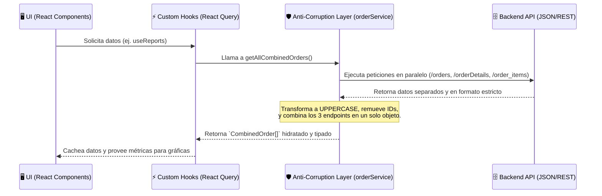

# Servicio al Cliente & Logística - Frontend Empresarial

Este repositorio contiene la Single Page Application (SPA) encargada de la gestión operativa, control de producción y logística de envíos para la planta. El código ha sido diseñado bajo estándares corporativos estrictos de **Clean Code, Arquitectura Resiliente y Optimización de Rendimiento**.

---

## 1. Diagrama de Arquitectura Global

La aplicación sigue el patrón **"Heavy Client"** y **"Anti-Corruption Layer"**. En lugar de que la interfaz visual hable directamente con el backend y sufra por su estricto formato, existe una capa intermedia (`orderService.ts`) que orquesta y traduce todo.



---

## 2. Decisiones Arquitectónicas

### A. Delegación Computacional (Frontend-Heavy)
El servidor es exclusivamente un proveedor de datos crudos. **Toda la lógica de negocio secundaria se computa en el cliente**.
* *Rendimiento:* Los cálculos ocurren dentro de Custom Hooks puros protegidos por `useMemo` para no bloquear el Main Thread.

### B. Diseño Feature-Sliced (Orientado a Dominios)
El código fuente está segregado por "Dominios de Negocio". Un dominio vive en su propio silo aislado.

```mermaid
graph TD
    A[src/app] --> B(Enrutador y Contextos Globales)
    C[src/features] --> D(Dominios de Negocio)
    D --> E[orders]
    D --> F[reports]
    D --> G[auth]
    H[src/shared] --> I(Componentes Genéricos y ACL)
    
    E -.->|Consume UI y API| H
    F -.->|Consume UI y API| H
    E -.x|Prohibido Importar| F
```

---

## 3. Diccionario de Archivos y Estructura Explicada

A continuación, se detalla exactamente qué guarda cada carpeta y archivo clave del sistema:

### 📁 `src/app/` (El Orquestador)
Contiene la configuración de nivel superior que envuelve a toda la app.
* **`App.tsx`**: Es el enrutador maestro. Define todas las URLs (`/orders`, `/reports`). Configura el `QueryClientProvider` para caché, el `ErrorBoundary` global y utiliza `React.lazy` para fragmentar el código (Code Splitting).

### 📁 `src/features/` (Los Silos de Negocio)
Aquí vive la lógica dividida por módulos:
* **`orders/pages/OrderFormPage.tsx`**: Formulario con validaciones estrictas para crear/editar transacciones de logística.
* **`orders/pages/OrderListPage.tsx`**: Tabla interactiva donde los operadores gestionan los camiones y los "Liberan" para envío.
* **`reports/hooks/useReports.ts`**: El "cerebro" matemático. Un Hook que descarga la data en caché y procesa cálculos de rendimiento (`onTimePct`, `fulfillPct`) para no sobrecargar la UI visual.
* **`reports/pages/ReportsPage.tsx`**: Un componente visual "tonto" (dumb) que simplemente se suscribe a `useReports.ts` y dibuja gráficas SVG mediante Recharts y medidores con Emojis.

### 📁 `src/shared/` (Recursos Compartidos)
Código promovido para ser usado por cualquier *feature*.
* **`api/axiosInstance.ts`**: El interceptor HTTP. Captura respuestas `401/500`, oculta las trazas de error y lanza alertas Toast globales en la UI. Inyecta el JWT en cada petición.
* **`api/orderService.ts`**: La **Capa Anti-Corrupción**. Intercepta objetos tipados de React y los destruye/formatea para cumplir el capricho estricto del backend (remueve campos `id` en PUTs, pasa estados a `UPPERCASE`). Es el orquestador absoluto.
* **`components/ErrorBoundary.tsx`**: Atrapa quiebres (crashes) de JavaScript y dibuja una tarjeta de error elegante en lugar de una pantalla blanca.
* **`components/Button.tsx` & `Card.tsx`**: El Design System interno. Centralizan clases repetitivas de Tailwind para botones y tarjetas.

### 📁 Archivos Raíz
* **`vitest.config.ts`**: Configuración corporativa del motor de pruebas unitarias.
* **`package.json`**: Administrador de dependencias. Contiene scripts como `npm run test` y usa la librería ultrarrápida `oxlint`.

---

## 4. Guía de Contribución (Agregando un Nuevo Módulo)

Si deseas agregar un nuevo módulo (Ejemplo: **Facturación**), debes seguir este flujo estricto:

1. Crea el dominio en features: `mkdir src/features/billing`
2. Divide el dominio internamente:
   - `components/` (UI exclusiva de facturación)
   - `hooks/` (Custom Hooks atados a React Query)
   - `pages/` (Vistas enrutables)
   - `types/` (Interfaces TypeScript exclusivas)
3. **Regla de Aislamiento:** Un archivo dentro de `billing` NO DEBE importar lógica desde `features/orders`. Si ambos dominios necesitan lo mismo, se extrae a `src/shared/`.
4. Añade la ruta de tu vista en `src/app/App.tsx` usando `React.lazy`.

---

## 5. Comandos de Operación

**Instalación:**
```bash
npm install
```

**Desarrollo Local:**
```bash
npm run dev
```

**Testing Unitario (Validación de Matemáticas y ACL):**
```bash
npm run test
```

**Construcción para Producción:**
```bash
npm run build
```
