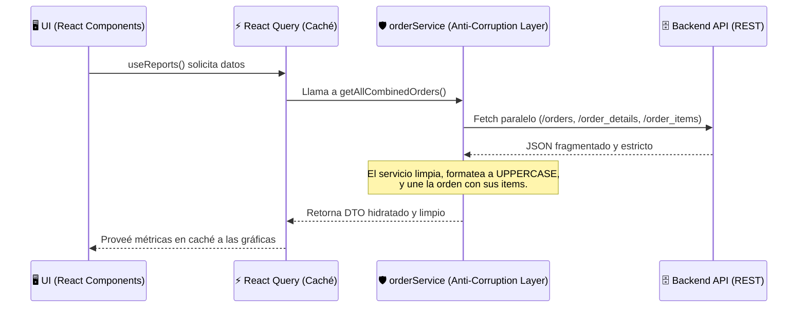
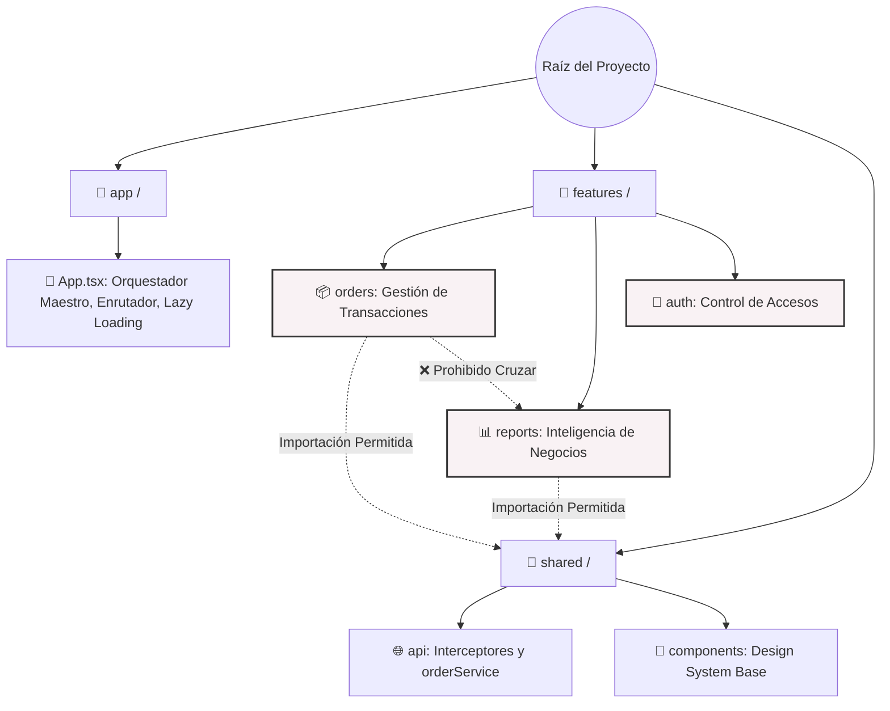

# Sistema de Logística y Servicio al Cliente (Frontend)

Este repositorio contiene la arquitectura Frontend (Single Page Application) diseñada a nivel corporativo para la **Gestión Operativa, Control de Producción y Logística de Envíos**.

El sistema actúa como la torre de control de la planta: permite a los operadores crear y monitorear transacciones de pedidos, gestionar la salida física (liberación) de camiones de entrega, y proyectar un Dashboard de Inteligencia de Negocios en tiempo real para gerencia, calculando métricas de rendimiento logístico y cumplimiento de productos.

---

## 1. Topología y Arquitectura del Proyecto

Para garantizar resiliencia, rendimiento y escalabilidad paralela, la aplicación emplea tres patrones de diseño críticos: **Frontend-Heavy Delegation**, **Feature-Sliced Design**, y un **Anti-Corruption Layer**.

### A. Delegación Computacional (Frontend-Heavy)
El servidor backend es tratado exclusivamente como un almacén de datos (Data Provider). La matemática pesada ocurre en el cliente:
* El cálculo de la **Métrica de Cumplimiento General** (Surtido vs Tiempo).
* La agregación de horas para detectar **Picos de Transporte**.
* La consolidación de órdenes maestras.

*Estrategia de Rendimiento:* Todo procesamiento masivo está aislado en *Custom Hooks* protegidos por Memoización (`useMemo`), impidiendo que el motor de renderizado de React (Main Thread) colapse o degrade los fotogramas por segundo (FPS).

### B. Anti-Corruption Layer (Capa de Traducción API)
El backend impone restricciones drásticas bajo el estándar OpenAPI 3.1.1 (ej. no permite incluir IDs en peticiones PUT, exige que todos los enumeradores de estado logístico viajen en UPPERCASE absoluto, y mantiene las cabeceras de orden separadas de sus ítems).



### C. Control de Acceso y Seguridad (RBAC)
La plataforma emplea un sistema de seguridad basado en roles (RBAC) gestionado localmente mediante un `AuthContext` reactivo y el componente `PermissionGuard`.
* **Protección de Rutas:** Cada módulo está protegido por un permiso específico (ej. `orders`, `reports`, `users`). 
* **Prevención de Escalación de Privilegios:** El payload de registro de usuarios previene activamente inyecciones de `roleId`.
* **Mitigación CWE-204:** Los endpoints de autenticación previenen la enumeración de usuarios utilizando mensajes de error genéricos ante credenciales inválidas.
* **Manejo Reactivo de Sesiones:** Cuando un token JWT expira (validado en cliente periódicamente o rechazado con un HTTP 401), se despacha un `CustomEvent` que limpia la sesión limpiamente a través de React Router en lugar de forzar recargas destructivas de la ventana.

---

## 2. Árbol de Directorios y Silos de Negocio

La base de código rechaza la estructura tradicional por tipo de archivo y abraza el **Diseño Orientado a Dominios (Feature-Sliced)**. A continuación, el mapa visual del ecosistema y su diccionario de responsabilidades:



### Diccionario Detallado del Proyecto

#### 📁 `src/app/` (El Motor de Arranque)
Es el punto de entrada de React.
* **`App.tsx`**: Contiene la definición de todas las rutas de la aplicación. Configura herramientas globales críticas: el `QueryClientProvider` para manejar la caché de datos asíncronos, el `ErrorBoundary` global para atrapar crashes, y `React.lazy` con `Suspense` para dividir el código (Code Splitting) y asegurar que el navegador solo descargue los módulos que el usuario realmente visita.

#### 📁 `src/features/` (Los Dominios de Negocio Aislados)
* **`orders/`**: Maneja la vida de un pedido. Contiene `OrderFormPage` (formulario con blindaje de inputs) y `OrderListPage` (tabla de control donde los operadores ejecutan la acción logística de "Liberar Camión").
* **`reports/`**: El motor analítico. Separa su lógica en `hooks/useReports.ts` (descarga en caché y procesa cálculos matemáticos sin tocar la UI) y `pages/ReportsPage.tsx` (una UI que únicamente "dibuja" gráficas de SVG usando Recharts y alertas visuales de Emojis).
* **`catalogs/` & `users/` & `auth/`**: Módulos encargados de la administración maestra de la plataforma.

#### 📁 `src/shared/` (El Núcleo Reutilizable)
* **`api/axiosInstance.ts`**: El guardián de la red. Contiene un interceptor global que captura respuestas fallidas (400, 401, 429, 500) y lanza notificaciones emergentes amigables (`react-hot-toast`), ocultando el terror técnico al usuario y cerrando sesiones expiradas automáticamente mediante eventos custom.
* **`api/orderService.ts`**: El cerebro de orquestación. Intercepta los objetos de la interfaz y los moldea obligatoriamente a los caprichos del backend antes de enviarlos a la red.
* **`context/AuthContext.tsx`**: Estado centralizado de seguridad que gestiona sesión, permisos JWT, perfiles y persistencia.
* **`components/`**: El "Design System" de la empresa. Contiene componentes de infraestructura UI pura como `Button.tsx`, `PermissionGuard.tsx` para RBAC y el `ErrorBoundary.tsx`.

---

## 3. Resiliencia y Control de Calidad (DX)

* **Zero White Screens:** El sistema está protegido por Error Boundaries. Si un componente de terceros falla al renderizar, la aplicación aislará el error en una tarjeta visual elegante sin colapsar el resto de la interfaz.
* **Tipado Estricto (TypeScript):** El proyecto aplica una filosofía de "cero tolerance to any". Las interfaces del modelo de datos (`CombinedOrder`, `CreateOrderPayload`) garantizan la integridad de la información en tiempo de compilación.
* **Linter de Alta Velocidad:** Se emplea `oxlint` para garantizar de forma ultrarrápida que el código se apegue a estándares profesionales antes de llegar a producción.

---

## 4. Guía de Contribución (Agregando Módulos)

Si el equipo de ingeniería necesita incorporar un nuevo dominio (por ejemplo, **Facturación / Billing**), los pasos inquebrantables son:

1. **Crear el Silo:** Construir la carpeta en `src/features/billing`.
2. **Sub-división Interna:** Establecer carpetas exclusivas para `components`, `hooks`, `pages` y `types`.
3. **Restricción de Aislamiento:** Bajo ninguna circunstancia el módulo de facturación puede importar la lógica de botones o hooks pertenecientes a `src/features/orders`. Si ambos requieren un mismo recurso, el código debe ser promovido al directorio maestro `src/shared/`.
4. **Registro Perezoso:** Agregar la nueva ruta en `src/app/App.tsx` utilizando obligatoriamente la sintaxis `lazy(() => import(...))`.

---

## 5. Instrucciones de Despliegue y Operación

**Clonar e Instalar:**
```bash
npm install
```

**Entorno de Desarrollo:**
```bash
npm run dev
```

**Auditoría y Pruebas Unitarias (Vitest):**
Ejecuta la suite de pruebas aislando las funciones matemáticas y validando la efectividad de la Capa Anti-Corrupción (Mocking).
```bash
npm run test
```

**Compilación Final Optimizada:**
```bash
npm run build
```

---

## 6. Despliegue y Desmontaje en Servidor (Nginx + UFW)

Los scripts de administración y hosting en Linux mediante Nginx se localizan en [`res/`](file:///home/toreve/projects/web/servicio-al-cliente-frontend/res). La SPA se compila estáticamente y se sirve a través de Nginx en el puerto `5175`.

### Despliegue del Frontend (`deployment.sh`)

```bash
# Compilar bundle, sincronizar a /srv/www, configurar Nginx y abrir puerto 5175 en UFW
./res/deployment.sh
```

**Flujo de despliegue:**
1. Compila el bundle estático de producción mediante `pnpm build`.
2. Sincroniza los archivos de `dist/` hacia `/srv/www/servicio-al-cliente-frontend`.
3. Abre el puerto `5175` en el firewall UFW mediante `sudo ufw allow 5175` (omitido si UFW no está instalado).
4. Instala la configuración de Nginx en `/etc/nginx/sites-available/` y crea el enlace en `sites-enabled/`.
5. Valida la configuración (`sudo nginx -t`) y recarga Nginx (`sudo systemctl reload nginx`).
6. Verifica el endpoint de salud en `http://127.0.0.1:5175/health`.

---

### Desmontaje y Apagado Completo (`down.sh`)

Para desmontar completamente la aplicación frontend, bloquear el puerto en el firewall y limpiar los recursos instalados, ejecuta [`res/down.sh`](file:///home/toreve/projects/web/servicio-al-cliente-frontend/res/down.sh):

```bash
# Desmontaje estándar: deshabilita sitio Nginx, recarga Nginx, bloquea puerto 5175 en UFW y elimina /srv/www
./res/down.sh

# Desmontaje conservando archivos instalados en /srv/www y dist/
./res/down.sh --keep-files

# Desmontaje purgando también el archivo de configuración en sites-available
./res/down.sh --purge-nginx
```

#### Opciones de CLI

| Opción | Descripción |
|---|---|
| `--keep-files` | Deshabilita el sitio Nginx y bloquea el puerto en UFW, pero preserva los archivos en `/srv/www/servicio-al-cliente-frontend` y `dist/`. |
| `--purge-nginx` | Elimina `/etc/nginx/sites-available/servicioAlClienteFrontend.conf` además del enlace habilitado. |
| `-h`, `--help` | Muestra la ayuda y descripción de opciones. |

#### Secuencia de Desmontaje (Paso a Paso)

1. **Deshabilitar Sitio Nginx:** Elimina el enlace simbólico `/etc/nginx/sites-enabled/servicioAlClienteFrontend.conf` (y `/etc/nginx/conf.d/` si aplica).
2. **Recargar Nginx:** Ejecuta `sudo nginx -t` y recarga el servicio (`sudo systemctl reload nginx`) para dejar de servir el puerto.
3. **Bloqueo de Puerto en Firewall (UFW):** Elimina reglas previas de permiso y bloquea el tráfico entrante ejecutando `sudo ufw deny 5175` (omitido con gracia si UFW no está instalado).
4. **Liberación de Procesos:** Verifica que no queden procesos residuales escuchando en el puerto `5175` mediante `fuser` y los termina si existen.
5. **Limpieza de Archivos:** Elimina el directorio de despliegue `/srv/www/servicio-al-cliente-frontend` y la carpeta `dist/` (salvo que se use `--keep-files`).
6. **Verificación:** Realiza una sonda al puerto `5175` para confirmar que ya no responde y la aplicación está totalmente fuera de línea.

---

### Variables de Entorno y Sobrescritura

Tanto `deployment.sh` como `down.sh` soportan las siguientes variables de entorno:

| Variable | Valor por Defecto | Descripción |
|---|---|---|
| `REPO_ROOT` | Raíz detectada del repositorio | Ruta del repositorio frontend. |
| `INSTALL_DIR` | `/srv/www/servicio-al-cliente-frontend` | Directorio de instalación web en el servidor. |
| `PORT` | `5175` | Puerto HTTP configurado en Nginx. |

